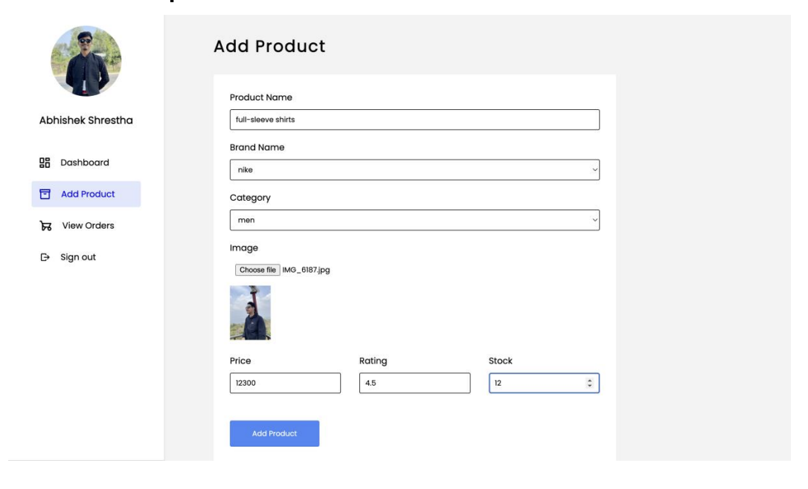
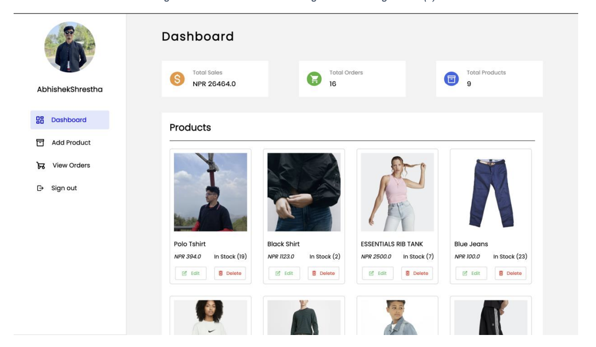

# E-Commerce Platform with Inventory Management

This project is a dynamic e-commerce platform built using **Java Servlets** for back-end development. It features a robust inventory management system, user authentication, secure transactions, and an order management system.

## Features

### 1. Real-time Inventory Management
- Tracks product stock levels in real-time.
- Seamless updates to product availability and inventory status.

### 2. Product Management
- Admins can list, filter, and search products.
- Includes advanced filtering and search functionality for users.
  
### 3. User Authentication & Secure Transactions
- Secure user authentication for safe transactions.
- Ensures the safety of user data and order processing.

### 4. Order Management System
- Users can view order history and track individual items.
- Orders are linked to user accounts, providing a comprehensive view of purchases.

## Tech Stack
- **Back-end:** Java Servlets
- **Database:** MySQL
- **Front-end:** HTML, CSS, JavaScript (for user interaction)

## Screenshots

